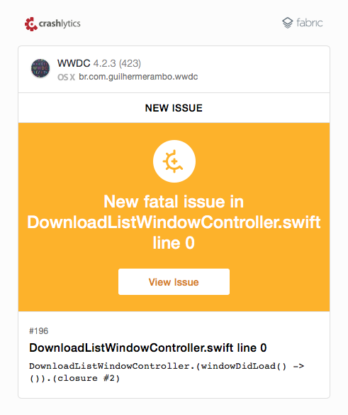

##Contributing to the unofficial WWDC app for macOS project

Thanks for your interest in contributing to the project. Please make sure you follow the guidelines to maximize the chances of your contribution being accepted.

##1. Issues

Here are the main reasons you might want to open an issue:

####I. Bugs

When the app behaves in an unexpected way or simply breaks, please file a bug report and describe what you were doing when the problem occurred, what was the expected result and what was the actual result.

Remember to include the version of the operating system you're running and the type/model of the machine (MacBook Mid 2009, iMac Late 2012, etc).

####II. Crashes

I use [Fabric](https://fabric.io) to track crashes, so every time the app crashes they get the crash log, symbolicate it and send me an e-mail which looks like this:



This is really helpful, but sometimes the crash logs are not enough to find the source of the problem, so if you get a crash please do open an issue and explain what you were trying to do when the crash happened. 

Remember to include the version of the operating system you're running and the type/model of the machine (MacBook Mid 2009, iMac Late 2012, etc).

####III. Feature Requests

If you want a new feature to be implemented, you can open an issue explaining why the feature would be useful to you and to other people and if you can convince me (or other contributors), it can be implemented.

Please keep in mind that I try to keep the app focused and exotic features or features which would add too much complexity to the code may be rejected.

##2. Code (Pull Requests)

Please note that some of these suggestions are not followed throughout the code because the project has been in development since the first version of Swift and some of the constructs where not even available then, these guidelines did not exist and the author was lazy. Just because you see a rule being broken doesn't mean you get to break it as well 😆

In fact, if you see some code not following these guidelines, fix it and send a pull request 🤓

####I. Tip: Check the roadmap and ask before you code

It's happened a couple of times that I was working on a feature and someone opened a pull request implementing the same feature I was working on. This wastes time and effort because only one of the solutions will actually be used, so before you start coding I suggest you take a look at the [roadmap](ROADMAP.md) to see what I'm working on currently.

If you see an open issue and you want to fix it, reply on the issue announcing that you're going to work on it so other people know there's someone already working on that.

####II. Use Swift, if you can

The app is written mainly in Swift but there are some components written in Objective-C because some of the features were hard to implement back when Swift was just getting started.

If you want to contribute and you don't want to write Swift code or don't know Swift, you can use Objective-C. But you really should be learning Swift 😬

####III. Use spaces instead of tabs

Do not start a war over this, I don't even have an opinion about this, I just use spaces because I contributed to some project once and people told me I had to use spaces, so I changed the setting in Xcode and never thought about it again, I have much more important stuff to worry about 🙄

Here's how my Xcode indentation preferences are, please use the same settings when working on this project:


####IV. Use `guard` and `return` early whenever possible

Instead of doing something like this:

```swift
func doSomethingIfNeeded() {
	if needed {
		doTheThing()
	}
}
```

Do this:

```swift
func doSomethingIfNeeded() {
	guard needed else { return }
	
	doTheThing()
}
```

Use `defer` if you must validate multiple things and do some cleanup or execute a callback before returning:

```swift
func doSomethingIfNeeded(mustCallThis: (result: String) -> ()) {
	var result = "noresult"
	
	defer {
		mustCallThis(result)
	}
	
	guard needed else { return }
	guard starsAreAligned else { return }
	
	doTheThing()
	result = computeResult()
}
```

####V. Avoid magic numbers and magic strings

If you need to reference specific numbers or strings, encapsulate them in `struct`s or `enum`s.

Here's an example, for some constants:

```swift
class MyCoolController {

	private struct Constants {
		static let name = "John Doe"
		static let specialNumber = 42
	}
	
	func doTheThingy() {
		return Constants.name + "'s number is " + Constants.specialNumber
	}
	
}
```

Here is another example, this time showing how to validate menu items without linking them directly with `IBOutlet` or using `title` and `action` to check which item is being validated:

```swift
class ImagesViewController: NSViewController {
	
	var collectionView: NSCollectionView
	
	// ...
	
	private enum MenuItemTags: Int {
		case ExportAllImages = 1001
		case ExportSelectedImages = 1002
	}
	
	override func validateMenuItem(menuItem: NSMenuItem) -> Bool {
		guard let itemValue = MenuItemTags(rawValue: menuItem.tag) else {
			return false
		}
		
		switch itemValue {
			case .ExportAllImages:
				return images.count > 0
			case .ExportSelectedImages:
				return collectionView.selectionIndexes.count > 0
		}
	}
	
}
```

####VI. Test your code thoroughly

When you think you're done with your contribution, try to break your code in as many different ways as possible to make sure your implementation is solid:

- If you change something related to the handling of user or application data (model layer) make sure to test the migration of data from a previous version of the app to your modified version.
- If you change a component related to networking, use the network link conditioner and test with a slow/bad connection to see how the app behaves
- If you change something related to UI, test It on both retina and non-retina screens

####VII. Dependencies

Do not add dependencies to the project unless they are absolutely essential to implement the functionality you're implementing. If you do add a dependency, use a well known and established library which is already in use by other major open source projects.

Please note that if you add a dependency on a pull request I will triple and quadruple check it before merging so it increases the risk of your contribution being rejected.

Do not bring in assets (icons, images) for which you don't have an appropriate license. Icons and images must have a Creative Commons or similar license to be used in this project. A good place to find free icons is [Icon Finder](https://iconfinder.com).

##3. Conclusion

These are just some suggestions for common scenarios, if you need help with your contribution you can always [tweet to me](https://twitter.com/_inside).

Have fun 🎉