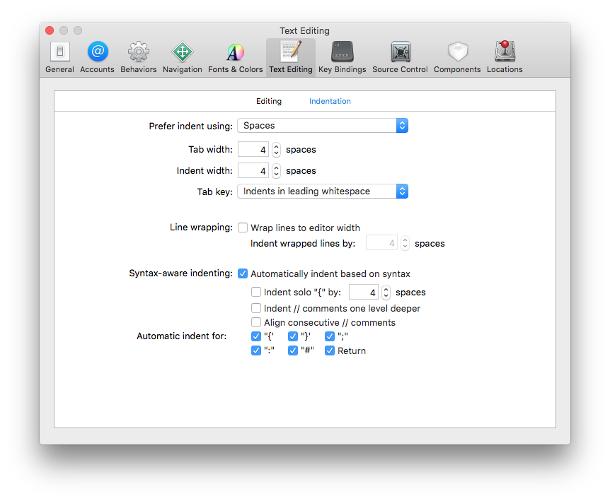

# Contributing to the Unofficial WWDC app for macOS Project

Thanks for your interest in contributing to the project. Please make sure you follow the guidelines to maximize the chances of your contribution being accepted.

## 1. Issues

Here are the main reasons you might want to open an issue:

#### I. Bugs

When the app behaves in an unexpected way or simply breaks, please file a bug report and describe what you were doing when the problem occurred, what was the expected result and what was the actual result.

Remember to include the version of the operating system you're running and the type/model of the machine (MacBook Mid 2009, iMac Late 2012, etc).

#### II. Crashes

If you get a crash please open an issue and explain what you were trying to do when the crash happened, include a video or screenshots of the problem if possible.

Remember to include the version of the operating system you're running and the type/model of the machine (MacBook Mid 2009, iMac Late 2012, etc).

#### III. Feature Requests

If you want a new feature to be implemented, you can open an issue explaining why the feature would be useful to you and to other people.

Whilst we want feature requests and suggestions to be as ambitious as possible, keep in mind that we try to keep the app focused, and niche features or features which would add a lot of complexity to the codebase may be rejected. If in doubt, it's better to suggest it than stay silent!

#### Issue template

Please follow the issue template provided when opening your issue, especially if it's a bug report.

## 2. Code (Pull Requests)

**Important: pull requests that only contain refactoring of existing code without fixing any bugs or linting messages, improving performance or implementing a new feature will not be accepted.**

#### I. Tip: Ask before you code

There have been a couple of times that we were working on a feature and someone opened a pull request implementing that same feature. This wastes time and effort because only one of the solutions can ultimately be used, so before you start coding we suggest you take a look at the open issues to see what's being worked on at the moment. If an issue already has someone assigned to it, don't start working on an implementation. If for some reason it's unclear whether they have made any progress or have time to continue, there's rarely any harm in asking.

It's also useful to open an issue before working on a new feature if it's not already listed, because not every feature fits our vision of the app and we would rather communicate this before someone spends a significant chunk of time working on it.

If you see an open issue and you want to fix it, reply to the issue announcing that you're going to work on it so other people know there's someone already working on that. Similarly, if you ever need any help or guidance implementing something then adding a new comment to the issue will help us spot it quickly! We're a friendly bunch.

#### II. Use Swift

All new code in the app should be written in Swift using the latest stable version of Xcode.

#### III. Keep indentation and style consistent

And yes, this means spaces instead of tabs. 😉 It's not worth starting a war over this -- we're not strongly opinionated about it! We just have a clear precedent in the codebase that isn't worth uprooting years into the project -- it simply leads to noisier diffs.

Here's how our Xcode indentation preferences look -- please try to use the same settings when working on the project:



#### IV. Use `guard` and `return` early whenever possible

Instead of doing something like this:

```swift
func doSomethingIfNeeded() {
	if needed {
		doTheThing()
	}
}
```

Do this:

```swift
func doSomethingIfNeeded() {
	guard needed else { return }
	
	doTheThing()
}
```

Use `defer` if you must validate multiple things and do some cleanup or execute a callback before returning:

```swift
func doSomethingIfNeeded(mustCallThis: (result: String) -> ()) {
	var result = "noresult"
	
	defer {
		mustCallThis(result)
	}
	
	guard needed else { return }
	guard starsAreAligned else { return }
	
	doTheThing()
	result = computeResult()
}
```

#### V. Avoid magic numbers and magic strings

If you need to reference specific numbers or strings, encapsulate them in `struct`s or `enum`s.

Here's an example, for some constants:

```swift
class MyCoolController {

	private struct Constants {
		static let name = "John Doe"
		static let specialNumber = 42
	}
	
	func doTheThingy() {
		return Constants.name + "'s number is " + Constants.specialNumber
	}
	
}
```

Here is another example, this time showing how to validate menu items without linking them directly with `IBOutlet` or using `title` and `action` to check which item is being validated:

```swift
class ImagesViewController: NSViewController {
	
	var collectionView: NSCollectionView
	
	// ...
	
	private enum MenuItemTags: Int {
		case ExportAllImages = 1001
		case ExportSelectedImages = 1002
	}
	
	override func validateMenuItem(menuItem: NSMenuItem) -> Bool {
		guard let itemValue = MenuItemTags(rawValue: menuItem.tag) else {
			return false
		}
		
		switch itemValue {
			case .ExportAllImages:
				return images.count > 0
			case .ExportSelectedImages:
				return collectionView.selectionIndexes.count > 0
		}
	}
	
}
```

#### VI. Test your code thoroughly and follow linting rules

When you think you're done with your contribution, try to break your code in as many different ways as possible to make sure your implementation is solid:

- If you change something related to the handling of user or application data (model layer) make sure to test the migration of data from a [previous release version of the app](https://github.com/insidegui/WWDC/releases) to your modified version.
- If you change a component related to networking, use Apple's Network Link Conditioner and test with a slow/bad connection to see how the app behaves. This conditioner is available from [`developer.apple.com`](https://developer.apple.com/download/more/), in the "Additional Tools for Xcode" bundle. 
- If you change something related to UI, try resizing the window and looking at different content to make sure it can adapt well to different environments.

Make sure your code is not introducing any new warnings, including those produced by Swiftlint.

#### VII. Dependencies

Do not add dependencies to the project. In an ideal world, we would be masters of our own destiny.

Do not bring in assets (icons, images) for which you don't have an appropriate license. Icons and images must have a Creative Commons or similar license to be used in this project. A good place to find free icons is [Icon Finder](https://iconfinder.com).

## 3. Conduct

The project has a [code of conduct](./CODE_OF_CONDUCT.md) that should be kept in mind when contributing -- whether that contribution is in the form of issues, comments, documentation or code. We reckon the fact that we've never had to enforce this is a pretty good sign of a healthy community, so let's keep it that way. 😉

Try to keep documentation and messages free of phrases that assume knowledge. If you're resorting to phrases like "obviously", "everyone knows" and "just", there's probably some context you're excluding. Not only does this help us be friendlier and more approachable for newcomers (bear in mind the app itself is an educational resource!), but it will probably help any programmer -- even you! -- who comes back to look at your code in months/years.

## 4. Conclusion

These are just some suggestions for common scenarios, if you need help with your contribution you can always open an issue to discuss it before doing the pull request.

Have fun 🎉