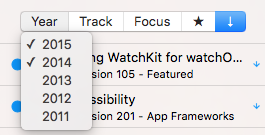
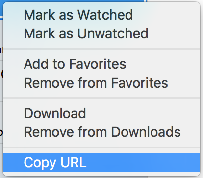
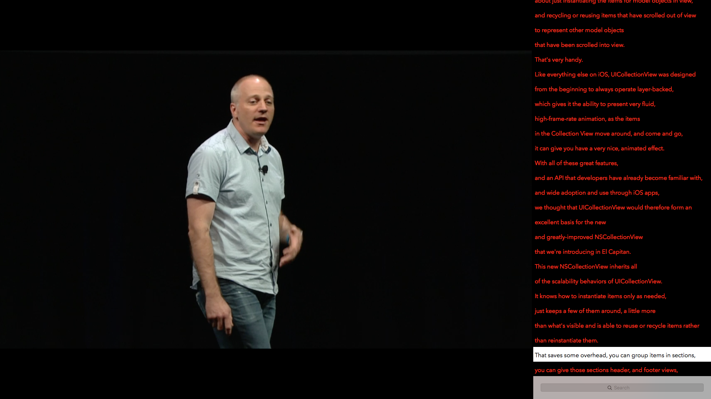

Psst, want me to love you? Then [check this out](https://getbrowserfreedom.com) 😁

# The WWDC app for macOS

This is the unofficial WWDC app for macOS.

Use this app to watch WWDC sessions on your Mac and do much more. Keep reading...

**⬇️ [Click here to download the latest release](https://raw.githubusercontent.com/insidegui/WWDC/master/Releases/WWDC_latest.zip) ⬇️**

## Schedule and Live Streaming

The app now shows the schedule for this year's sessions.

Please note that since this app is focused on videos, the schedule only shows sessions which will be live streamed, not labs and other events.

When sessions are live, a "live" indicator appears on the list and a "Watch Live" button becomes available:

## Searching

The app has a powerful search feature. When you first launch the app, It indexes the videos database and downloads transcripts from ASCIIWWDC, so when you search, not only will you get search results from session titles and descriptions, but also from what the presenter said in the sessions.

The app even shows a list of phrases matching your search so you can jump right to the point in the session where your searched word/phrase appears.

With the handy filter bar you can filter sessions by year, track and focus, and also filter to show only favorited or downloaded sessions.

	
## Sharing

You can share direct links to specific session videos. Just select the session on the list and ⌘C to copy It's URL, or use the right-click menu.

## Reading

WWDC for macOS is integrated with [ASCIIWWDC](http://asciiwwdc.com), so you can see and search through transcripts of the sessions while watching the videos.

## Build Instructions

**Pre-requisites:**

- Xcode 7.3 or later
- [CocoaPods](https://cocoapods.org)

Clone the repository:

	$ git clone --recursive https://github.com/insidegui/WWDC.git

Install dependencies:

	$ pod install

### Cask

You can also install using [Homebrew Cask](http://caskroom.io):

	$ brew cask install wwdc
	
### PlayBack Tip: Speed Up / Slow Down

Speed up or slow down playback by ⌥ + clicking on the skip forward or backward arrows on the player window.
