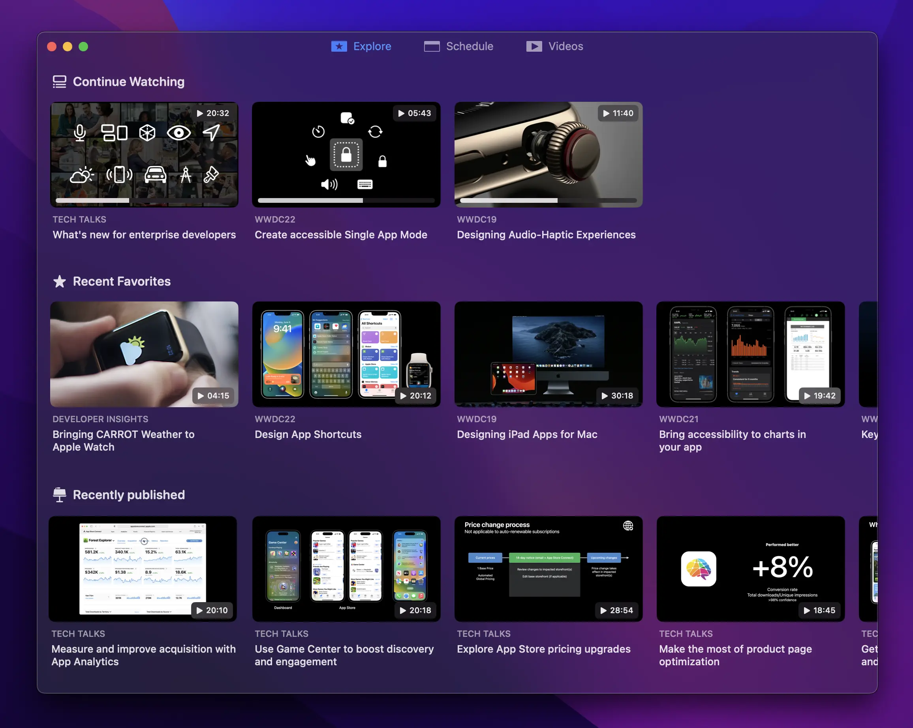
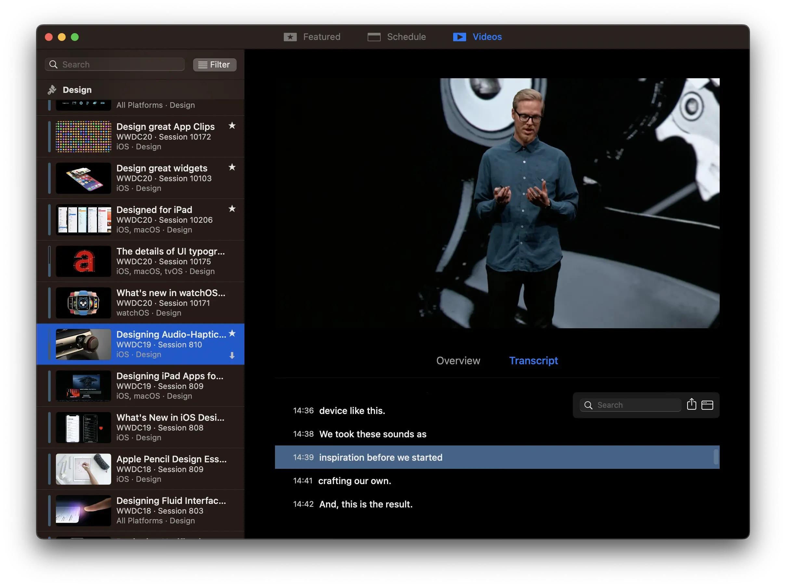
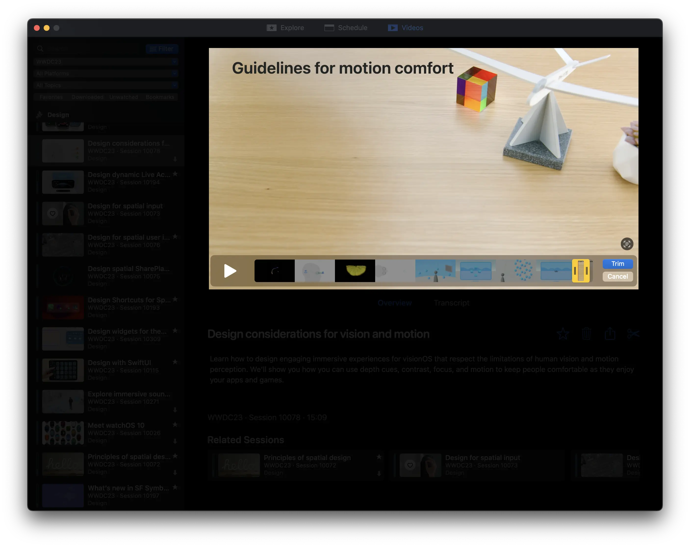
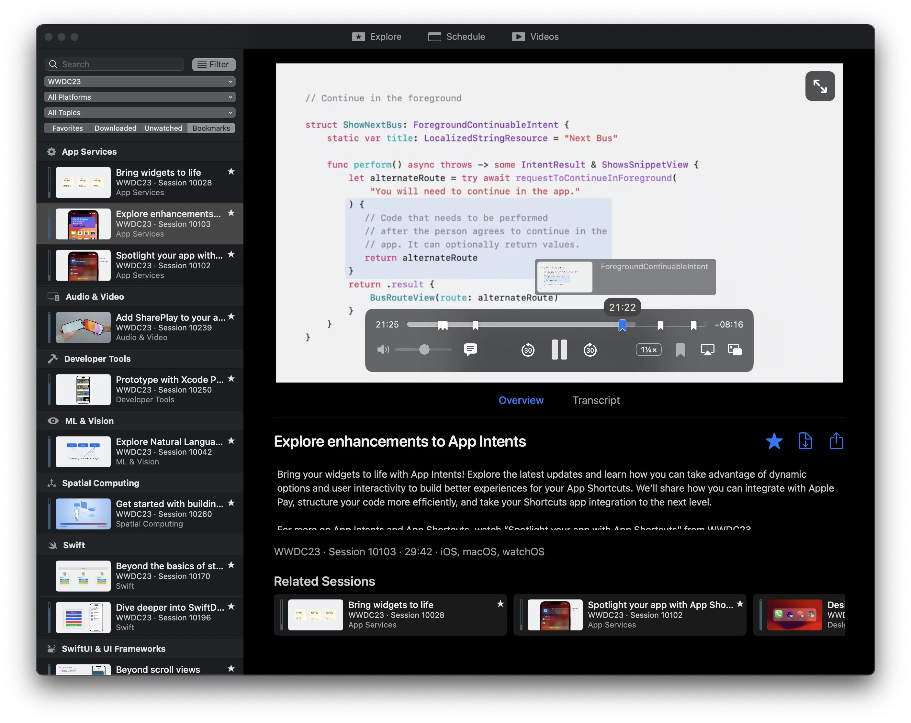

# The unofficial WWDC app for macOS

Enjoy WWDC from the comfort of your Mac with the unofficial WWDC app for macOS.

Watch the Keynote and Platforms State of the Union live, as well as the videos for all sessions released during WWDC week and other video content you can find on Apple's website or [Developer](https://apps.apple.com/app/apple-developer/id640199958) app.

Keep track of the videos you’d like to watch or the ones you’ve already watched and take notes that you can reference later when trying out new technologies you learned about in the sessions.

⬇️ If you just want to download the latest release, go to [the releases page](https://github.com/insidegui/WWDC/releases/latest).

## Explore

The Explore tab shows an overview of the latest content available, the videos you haven’t finished watching yet, recently favorited videos, as well as any special events that are currently live.

## Schedule

The Schedule tab shows the schedule for each day in the current edition of WWDC and allows you to watch live streams for the Keynote and other sessions throughout the week.

## Videos

Watch this year’s videos as they’re released and access videos from previous years. You can also read transcripts of sessions and easily jump to a specific point in the relevant video. Transcripts are also searchable and available in multiple languages.

### Features

- Watch videos in 0.5x, 1x, 1.25x, 1.5x, 1.75x or 2x speeds
- Fullscreen and native picture-in-picture support
- Navigate video contents easily with the help of transcripts

### Clip Sharing

Clip Sharing allows you to share a short segment (up to 5 minutes) from a session’s video. This is a great feature for quickly sharing snippets of content from the conference.

## Bookmarks

Have you ever found yourself watching a WWDC session and wishing you could take notes at a specific point in the video to refer back to later on? This is now possible with bookmarks.

With bookmarks, you can create a reference point within a video and add an annotation to it. Your bookmark annotations can also be considered while using the search, so it’s easier than ever to find the content you've bookmarked before.

## iCloud Sync

Enable the iCloud sync feature in preferences and your favorites, bookmarks and progress in sessions will be synced across your Macs.

## Sharing

You can easily share links to sessions or videos by using the share button. The links shared are universal links that redirect to Apple’s developer website, so if they’re opened on a Mac which has the app installed, they will open in the app. The links are also compatible with iOS devices using the Apple Developer app.

## Nerdy bits 🤓

### Code of Conduct
We expect all of our contributors to help uphold the values set out in our [code of conduct](./CODE_OF_CONDUCT.md). We fundamentally believe this will help us build a better community, and with it a better app.

### Contributing

Please read the [contribution guidelines](CONTRIBUTING.md) before opening an issue or pull request.

### External libraries

A number of third-party libraries are used by the app:

- [Realm](https://realm.io): data storage and caching
- [Sparkle](https://sparkle-project.org/): automatic updates
- [CloudKitCodable](https://github.com/insidegui/CloudKitCodable): sync support
- [Siesta](http://bustoutsolutions.github.io/siesta/): networking
- [RxSwift](https://github.com/ReactiveX/RxSwift): reactive extensions
- [RxRealm](https://github.com/RxSwiftCommunity/RxRealm): reactive extensions for Realm

### Internal libraries

- **ConfCore** is the core of the app that deals with Apple's WWDC API, data storage, caching, syncing and transcripts (everything that has to do with data, basically)
- **ConfUIFoundation** contains shared color, font definitions and other useful extensions used by the main app target and `PlayerUI`
- **PlayerUI** contains the UI components for the video player and some general-purpose UI components used throughout the app

## Building the app

**Building requires Xcode 14 or later.**

**Clone this branch and before opening the project, run `./bootstrap.sh`** to setup the environment. The script will ask for your Apple Developer team ID in order to configure the project. There's no need to change any code signing settings in Xcode. The bootstrap script will also install `swiftlint` for you using `brew` if you don’t have it yet.

Since the app uses CloudKit, when you build it yourself, all CloudKit-related functionality will be disabled.

**Always use the `WWDC` scheme when building** (the one that doesn't mention iCloud in its name).

### Clearing app data during development

If you need to clear the app’s preferences and stored data during development, you can run `./cleardata.sh` in the project folder. **This will delete all of your preferences and data like favorites, bookmarks and progress in videos, so be careful**.

