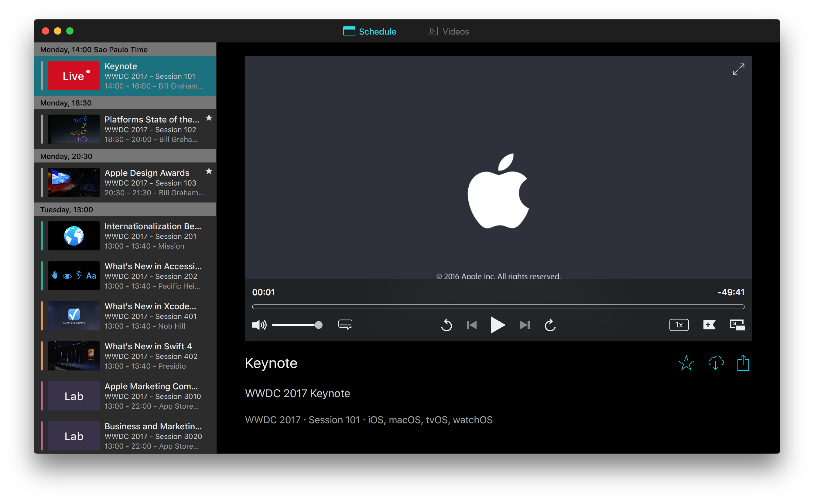
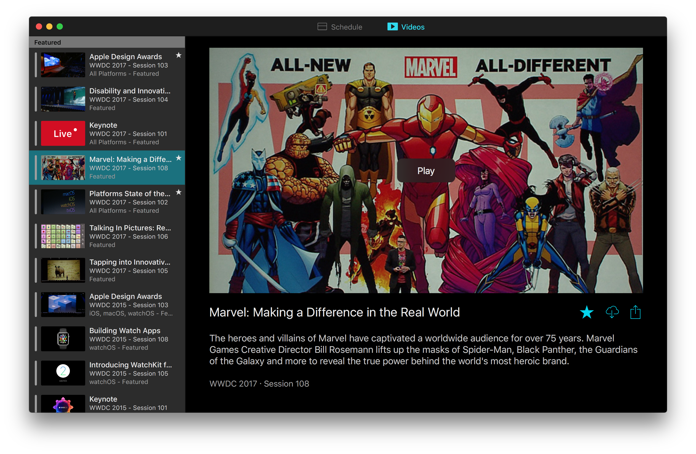

## The unofficial WWDC app for macOS

> Maybe I am making a big deal out of it but love how the time for the events change according to your timezone! Nice touch.
> 
> *Yiğitcan, Product Hunt*

-----------------

> Handy for those who like to read instead of listen, but equally important for those who may have hearing issues.
> 
> *Nate Swanner, The Next Web*

-----------------

> So refreshing to see a nice desktop app built without Electron
> 
> *Longhanks, Hacker News*

## Schedule

The schedule tab shows the schedule for the current edition of the event, and this is where you can watch the live stream for the Keynote and other sessions.

## Videos

Watch this year's videos as they're released and also videos from previous editions. With [ASCIIWWDC](http://asciiwwdc.com) integration, you can also read transcripts of the sessions and easily jump to specific parts of videos.

### Building the app

Building the app requires [Carthage](https://github.com/Carthage/Carthage) to be installed.

Clone this branch and before opening the project, run `./bootstrap.sh` to fetch the dependencies (this script can take a while to run, that's normal).